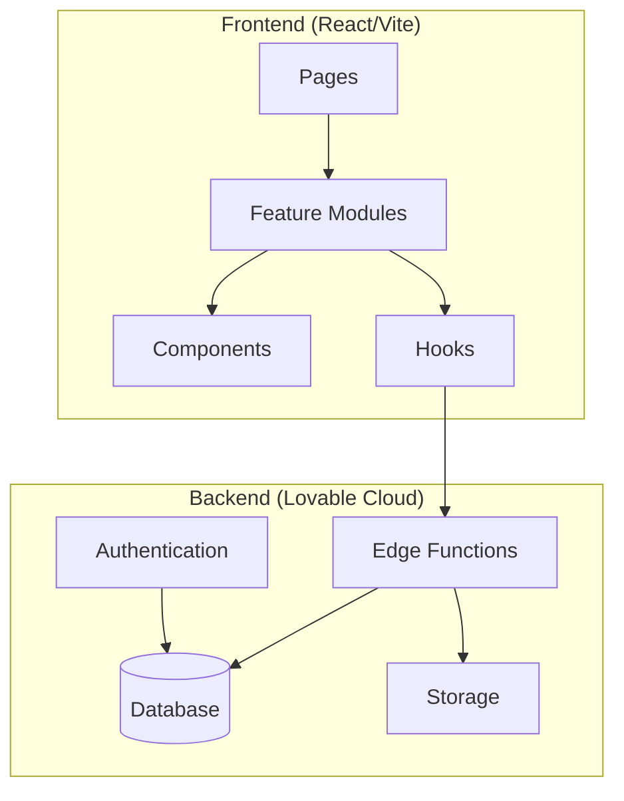
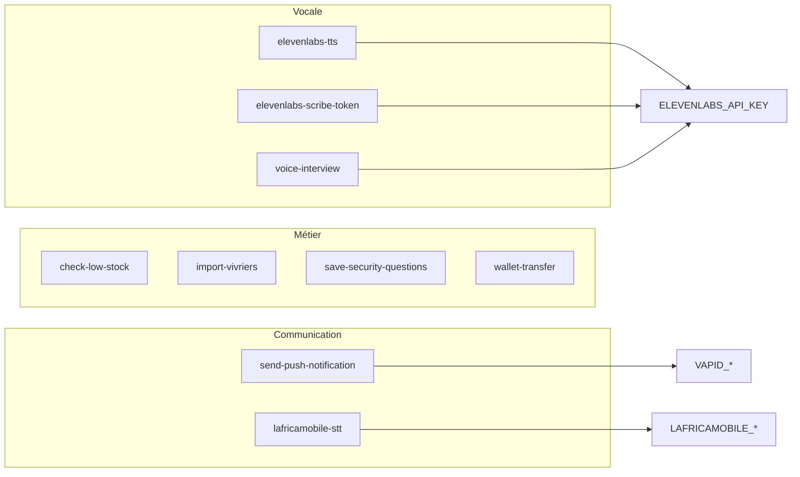
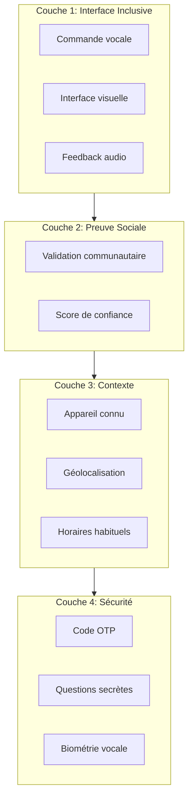
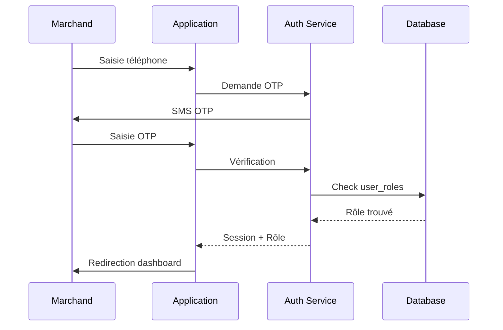
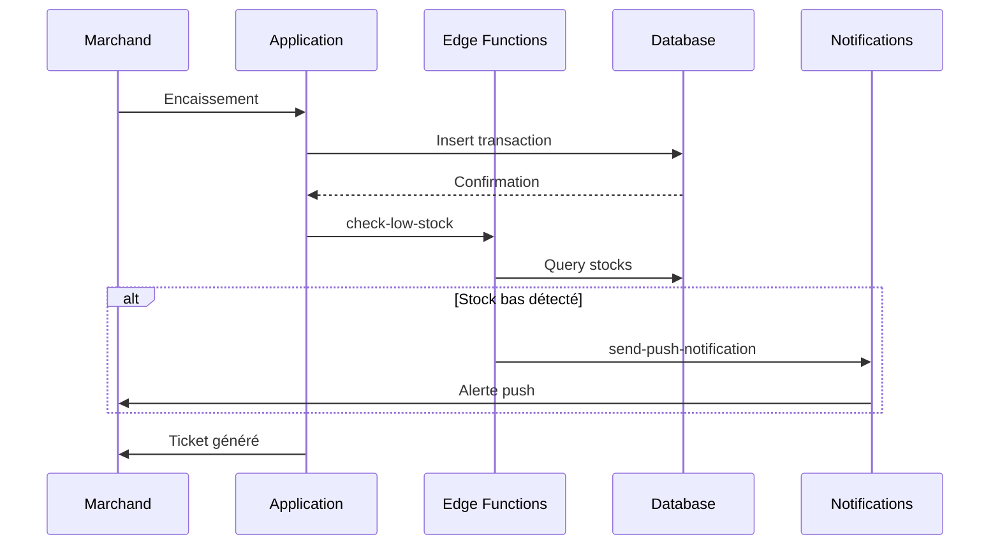
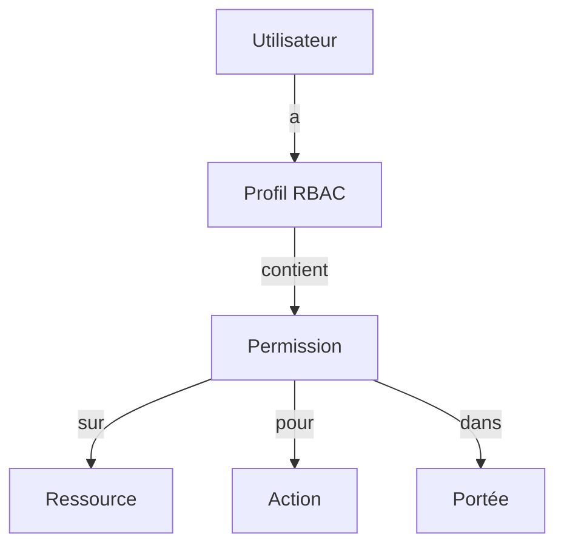

# Architecture du Projet IFN

> Documentation mise à jour après 7 phases de cleanup (Janvier 2026)

## Vue d'ensemble



## Structure des Dossiers

```
src/
├── features/              # Modules métier (8 modules)
│   ├── admin/             # Dashboard admin, RBAC, KYC
│   ├── agent/             # Enrôlement, dashboard agent
│   ├── auth/              # Authentification, sessions
│   ├── cooperative/       # Gestion coopératives
│   ├── kyc/               # Vérification identité
│   ├── merchant/          # Caisse, stock, crédits
│   ├── notifications/     # Push notifications
│   └── wallet/            # Portefeuille, transferts
│
├── components/            # Composants UI (11 dossiers)
│   ├── admin/             # Composants admin
│   │   └── map/           # Cartographie (MapFilters, MapLegend)
│   ├── agent/             # Composants agent
│   │   └── enrollment/    # Wizard enrôlement (Step1-5)
│   ├── auth/              # OTPInput, ProtectedRoute
│   ├── cooperative/       # Orders, Stock
│   ├── ifn/               # Composants institutionnels
│   ├── market/            # Composants marché
│   ├── merchant/          # Cashier, Stock, Credits
│   ├── pnavim/            # Interface vocale (6 composants)
│   │   ├── PnavimVoiceButton.tsx
│   │   ├── PnavimVoiceRecorder.tsx
│   │   ├── PnavimVoiceRecorderCompact.tsx
│   │   ├── PnavimAnimatedCharacter.tsx
│   │   ├── PnavimMascot.tsx
│   │   └── pnavim-utils.ts
│   ├── shared/            # Headers, navs, états
│   ├── studio/            # Enregistrement audio
│   └── ui/                # shadcn/ui
│
├── pages/                 # Pages de l'application
│   ├── admin/             # Dashboard, RBAC, KYC, Maps
│   ├── agent/             # Dashboard, Enrôlement
│   ├── auth/              # Login, Register
│   ├── cooperative/       # Dashboard, Orders, Stock
│   ├── account/           # Mon compte
│   └── merchant/          # Dashboard, Caisse, Stock
│
├── contexts/              # Contextes React
│   ├── AuthContext.tsx    # Session et rôles
│   └── LanguageContext.tsx # i18n
│
├── hooks/                 # 19 hooks personnalisés
│   ├── useDataFetching.ts # Fetch générique avec retry
│   ├── useMerchantStock.ts
│   ├── useCooperativeStock.ts
│   ├── useCooperativeOrders.ts
│   ├── useAdminMapData.ts
│   ├── useOfflineSync.ts
│   └── ...
│
├── lib/                   # Utilitaires
│   ├── validationSchemas.ts
│   ├── offlineDB.ts
│   ├── imageCompression.ts
│   └── ...
│
├── infra/                 # Infrastructure
│   └── logger.ts          # Logging centralisé
│
├── shared/                # Types partagés
│   └── types/
│       ├── errors.ts
│       ├── ui.ts
│       └── index.ts
│
└── integrations/          # Supabase client (auto-généré)
    └── supabase/
```

## Architecture Backend

### Edge Functions actives



### Détail des fonctions

| Fonction | Rôle | Secrets requis |
|----------|------|----------------|
| `check-low-stock` | Vérifie les stocks bas et génère alertes | - |
| `elevenlabs-scribe-token` | Token pour transcription vocale | `ELEVENLABS_API_KEY` |
| `elevenlabs-tts` | Synthèse vocale (Text-to-Speech) | `ELEVENLABS_API_KEY` |
| `import-vivriers` | Import des produits vivriers | - |
| `lafricamobile-stt` | Transcription via L'Africamobile | `LAFRICAMOBILE_*` |
| `save-security-questions` | Sauvegarde questions de sécurité | - |
| `send-push-notification` | Envoi notifications push | `VAPID_*` |
| `voice-interview` | Interview vocale interactive | `ELEVENLABS_API_KEY` |
| `wallet-transfer` | Transferts entre wallets | - |

## Architecture d'Authentification

### Modèle 4 couches



### Flux d'authentification



## Flux de Données



## Rôles et Permissions

| Rôle | Pages accessibles | Permissions clés |
|------|-------------------|------------------|
| `merchant` | `/marchand/*` | Caisse, stock, crédits, profil |
| `cooperative` | `/cooperative/*` | Commandes, stock, livraisons |
| `agent` | `/agent/*` | Enrôlement, validation, dashboard |
| `admin` | `/admin/*` | RBAC, KYC, maps, supervision |

### Système RBAC



## Patterns Utilisés

### 1. Feature-based Architecture
- Chaque feature est autonome avec ses hooks, services et types
- Export public via `index.ts`
- Facilite le tree-shaking et la maintenance

### 2. Séparation Logique / UI
- **Hooks** contiennent la logique métier (`useMerchantStock`, `useCooperativeOrders`)
- **Components** sont purement présentationnels
- **Pages** orchestrent les composants et hooks

### 3. Gestion des Erreurs
- **AppError** (`src/shared/types/errors.ts`) - classe d'erreur standardisée
- **useDataFetching** - hook avec retry automatique et gestion d'état
- **ErrorBoundary** - capture erreurs React

### 4. Logging Centralisé
- **logger** (`src/infra/logger.ts`) - remplace console.*
- Loggers pré-configurés: `authLogger`, `merchantLogger`, `agentLogger`, `coopLogger`, `adminLogger`, `syncLogger`
- Stockage local pour debug

### 5. Validation
- **Zod** pour validation des formulaires (`src/lib/validationSchemas.ts`)
- Schémas réutilisables: phone, email, password, OTP

### 6. Types Centralisés
- **`src/shared/types/index.ts`** - dérivés du schéma Supabase
- Single Source of Truth pour les types métier

### 7. Mode Hors-ligne
- **IndexedDB** pour stockage local
- **useOfflineSync** - queue et synchronisation
- **Service Worker** pour PWA

## Conventions de Nommage

| Type | Convention | Exemple |
|------|------------|---------|
| Components | PascalCase | `StockCard.tsx` |
| Hooks | camelCase + `use` | `useMerchantStock.ts` |
| Pages | PascalCase | `MerchantDashboard.tsx` |
| Types | PascalCase | `MerchantStatus` |
| Constantes | SCREAMING_SNAKE | `MAX_RETRY_COUNT` |
| Features | kebab-case dossier | `src/features/merchant/` |

## Règles de Refactoring

1. **Aucun fichier > 300 lignes** - split en hooks et composants
2. **Un composant = une responsabilité**
3. **Hooks pour la logique réutilisable**
4. **Types dans `shared/types` pour les données métier**
5. **Logger centralisé au lieu de console.**
6. **Feature modules pour le code métier isolé**

## Dépendances Clés

| Catégorie | Packages |
|-----------|----------|
| Core | React 18, TypeScript, Vite |
| UI | Tailwind CSS, shadcn/ui, Framer Motion |
| Backend | Supabase (Lovable Cloud) |
| Data | React Query, Zod |
| Visualisation | Recharts, Leaflet |
| Audio | ElevenLabs React |

## Métriques Post-Cleanup

> Résultats des 7 phases de nettoyage (Janvier 2026)

| Métrique | Avant | Après | Réduction |
|----------|-------|-------|-----------|
| Edge Functions | 14 | 9 | **-36%** |
| Composants Pnavim | 16 | 6 | **-63%** |
| Fichiers morts | 13 | 0 | **-100%** |
| Lignes de code | ~8500 | ~7900 | **-7%** |

### Fichiers supprimés
- 5 Edge Functions inutilisées
- 10 composants Pnavim dupliqués
- 2 pages legacy
- 1 hook mock
- Imports orphelins nettoyés
