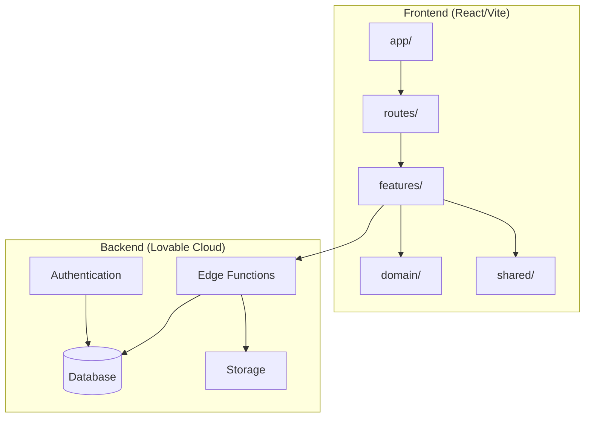
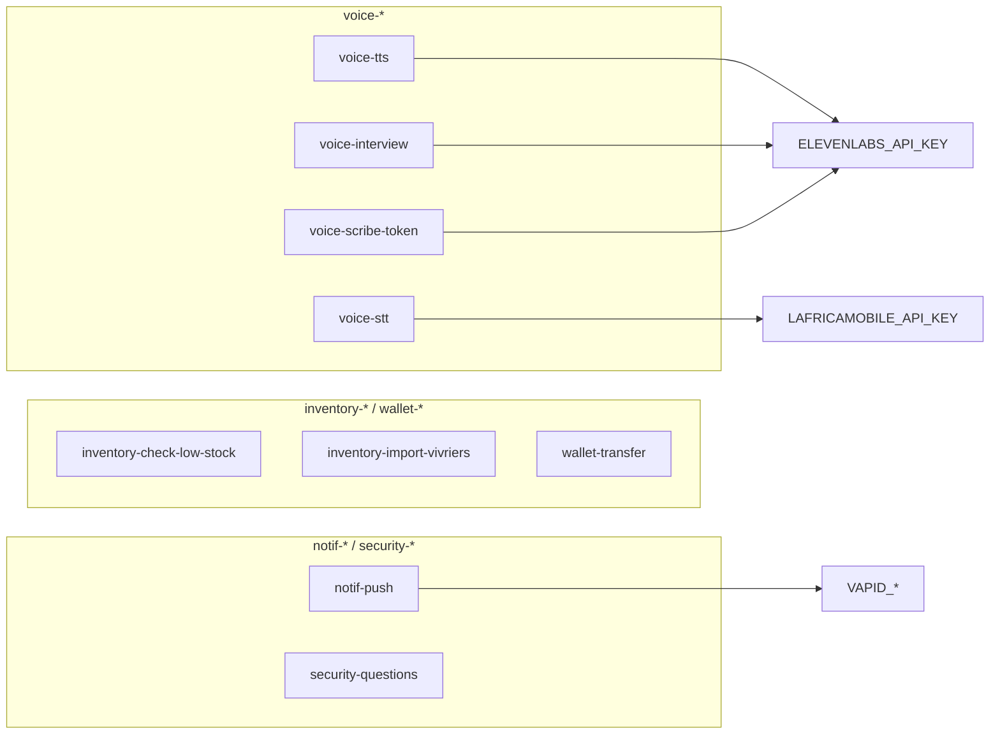
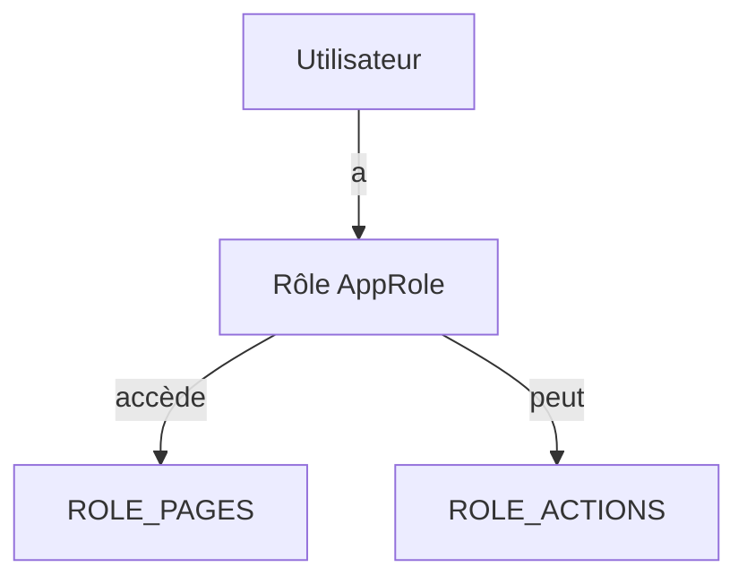
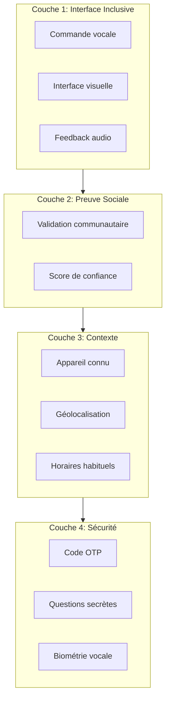
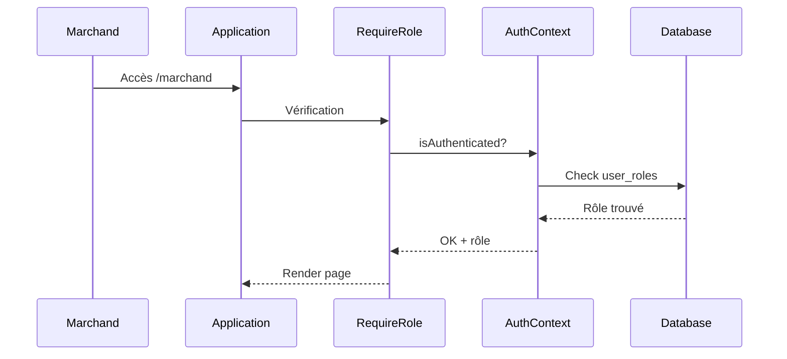
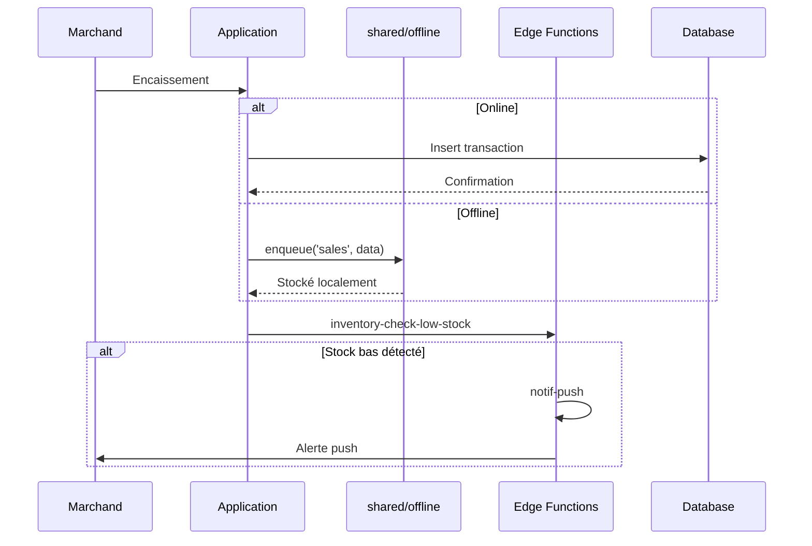
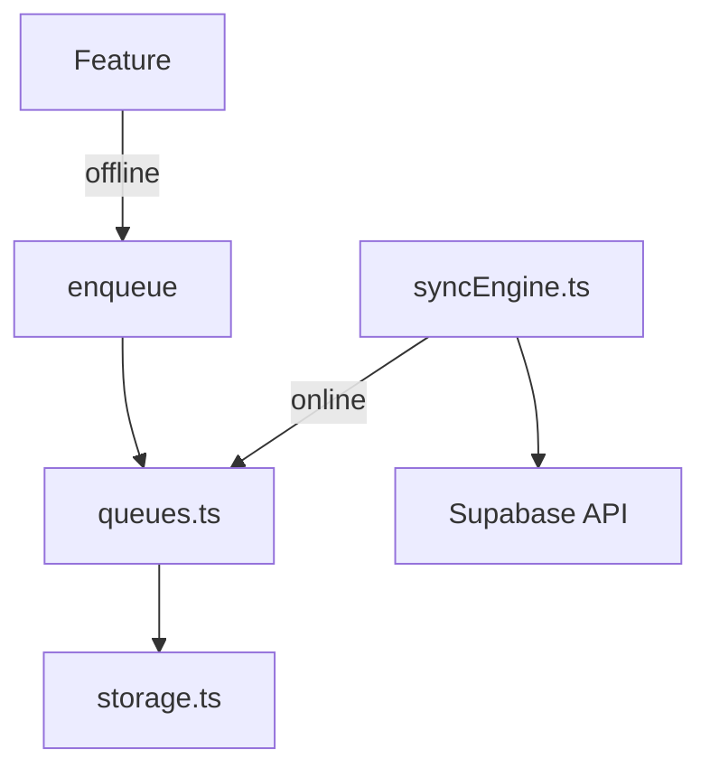

# Architecture du Projet IFN

> Documentation mise à jour - Architecture "Industrie" (Janvier 2026)

## Vue d'ensemble

Le projet IFN suit une architecture **Vertical Slices** professionnelle, avec :
- **Features autonomes** : chaque module métier contient pages, composants, hooks et services
- **RBAC centralisé** : une source unique de vérité pour les permissions
- **Offline-first** : capability partagée pour le mode hors-ligne
- **Routes par rôle** : séparation claire des accès



## Structure des Dossiers

```
src/
├── app/                   # Bootstrap et configuration
│   ├── guards/            # RequireRole, RequireAuth
│   ├── layouts/           # AppShell
│   ├── providers/         # Auth, Language, Audio
│   └── index.ts
│
├── routes/                # Routes par rôle
│   ├── public.routes.tsx
│   ├── merchant.routes.tsx
│   ├── agent.routes.tsx
│   ├── cooperative.routes.tsx
│   ├── admin.routes.tsx
│   └── index.ts
│
├── domain/                # Types métier et règles pures
│   ├── rbac.ts            # RBAC centralisé
│   └── index.ts
│
├── features/              # Modules métier (Vertical Slices)
│   ├── admin/
│   │   ├── components/
│   │   ├── hooks/
│   │   ├── services/
│   │   ├── types/
│   │   └── index.ts
│   ├── agent/
│   ├── auth/
│   ├── cooperative/
│   ├── kyc/
│   ├── merchant/
│   ├── notifications/
│   └── wallet/
│
├── shared/                # Utilitaires partagés
│   ├── offline/           # Capability offline
│   │   ├── storage.ts     # IndexedDB
│   │   ├── queues.ts      # Actions en attente
│   │   └── syncEngine.ts  # Synchronisation
│   ├── hooks/             # Hooks génériques
│   ├── services/          # Services partagés
│   ├── types/             # Types partagés
│   └── index.ts
│
├── components/            # Composants UI
│   ├── ui/                # shadcn/ui
│   ├── shared/            # Headers, navs, états
│   └── pnavim/            # Interface vocale
│
├── pages/                 # Pages (legacy, migration en cours)
│   ├── admin/
│   ├── agent/
│   ├── cooperative/
│   └── merchant/
│
├── contexts/              # Contextes React
│   ├── AuthContext.tsx
│   ├── LanguageContext.tsx
│   └── AudioContext.tsx
│
├── hooks/                 # Hooks globaux
├── lib/                   # Utilitaires
├── infra/                 # Infrastructure (logger)
└── integrations/          # Supabase client (auto-généré)
```

## Architecture "Industrie"

### Principes

1. **Vertical Slices** : Tout le code d'une feature au même endroit
2. **RBAC Centralisé** : `src/domain/rbac.ts` comme source de vérité
3. **Offline Partagé** : `src/shared/offline/` comme capability
4. **Routes par Rôle** : `src/routes/*.routes.tsx`
5. **Guards Réutilisables** : `src/app/guards/`

### ADRs (Architecture Decision Records)

| ADR | Titre | Statut |
|-----|-------|--------|
| [001](./adr/001-vertical-slices.md) | Architecture Vertical Slices | Accepté |
| [002](./adr/002-edge-functions-naming.md) | Convention nommage Edge Functions | Accepté |
| [003](./adr/003-rbac-centralized.md) | RBAC centralisé | Accepté |
| [004](./adr/004-offline-first.md) | Stratégie Offline-First | Accepté |

## Architecture Backend

### Edge Functions actives



### Détail des fonctions

| Fonction | Rôle | Secrets requis |
|----------|------|----------------|
| `voice-tts` | Synthèse vocale (Text-to-Speech) | `ELEVENLABS_API_KEY` |
| `voice-stt` | Transcription via L'Africamobile | `LAFRICAMOBILE_*` |
| `voice-interview` | Interview vocale interactive | `ELEVENLABS_API_KEY` |
| `voice-scribe-token` | Token pour transcription | `ELEVENLABS_API_KEY` |
| `inventory-check-low-stock` | Vérifie les stocks bas | - |
| `inventory-import-vivriers` | Import des produits vivriers | - |
| `wallet-transfer` | Transferts entre wallets | - |
| `notif-push` | Envoi notifications push | `VAPID_*` |
| `security-questions` | Sauvegarde questions sécurité | - |

## RBAC Centralisé

### Source de vérité : `src/domain/rbac.ts`

```typescript
// Rôles disponibles
type AppRole = 'admin' | 'agent' | 'cooperative' | 'merchant' | 'user';

// Pages par rôle
ROLE_PAGES.merchant = ['dashboard', 'cashier', 'stock', ...];
ROLE_PAGES.admin = ['dashboard', 'merchants', 'users', 'kyc', ...];

// Actions par rôle
ROLE_ACTIONS.merchant = ['sell', 'view_stock', 'transfer_money', ...];
ROLE_ACTIONS.admin = ['*']; // Toutes les actions

// Helpers
hasPermission(role, action); // Vérifie une permission
canAccessPage(role, page);   // Vérifie l'accès à une page
```

### Système de permissions



### Rôles et accès

| Rôle | Chemin base | Pages clés |
|------|-------------|------------|
| `merchant` | `/marchand` | Dashboard, Caisse, Stock, Wallet |
| `agent` | `/agent` | Dashboard, Enrôlement, Marchands |
| `cooperative` | `/cooperative` | Dashboard, Stock, Commandes |
| `admin` | `/admin` | Dashboard, Users, KYC, Maps |

## Architecture d'Authentification

### Modèle 4 couches



### Flux d'authentification



## Flux de Données



## Offline Capability

### Structure : `src/shared/offline/`

```typescript
// Storage - IndexedDB wrapper
initOfflineStorage();
getFromCache<T>(key);
setInCache<T>(key, value);

// Queues - Actions en attente
enqueue('sales', 'create', saleData);
getQueue('sales');
dequeue(itemId);

// Sync Engine - Synchronisation automatique
registerSyncHandler('sales', handler);
syncAll();
setupAutoSync(); // Hook sur événement 'online'
```

### Architecture



## Patterns Utilisés

### 1. Vertical Slices
- Chaque feature est autonome
- Export public via `index.ts`
- Voir [ADR-001](./adr/001-vertical-slices.md)

### 2. RBAC Centralisé
- Source unique : `src/domain/rbac.ts`
- Guards réutilisables
- Voir [ADR-003](./adr/003-rbac-centralized.md)

### 3. Offline-First
- Capability partagée : `src/shared/offline/`
- Sync automatique
- Voir [ADR-004](./adr/004-offline-first.md)

### 4. Gestion des Erreurs
- **AppError** - classe standardisée
- **useDataFetching** - retry automatique
- **ErrorBoundary** - capture erreurs React

### 5. Logging Centralisé
- **logger** (`src/infra/logger.ts`)
- Loggers pré-configurés par domaine

## Conventions de Nommage

| Type | Convention | Exemple |
|------|------------|---------|
| Components | PascalCase | `StockCard.tsx` |
| Hooks | camelCase + `use` | `useMerchantStock.ts` |
| Pages | PascalCase | `MerchantDashboard.tsx` |
| Types | PascalCase | `MerchantStatus` |
| Constantes | SCREAMING_SNAKE | `MAX_RETRY_COUNT` |
| Features | kebab-case dossier | `src/features/merchant/` |
| Edge Functions | domain-action | `voice-tts`, `inventory-check-low-stock` |

## Dépendances Clés

| Catégorie | Packages |
|-----------|----------|
| Core | React 18, TypeScript, Vite |
| UI | Tailwind CSS, shadcn/ui, Framer Motion |
| Backend | Supabase (Lovable Cloud) |
| Data | React Query, Zod |
| Visualisation | Recharts, Leaflet |
| Audio | ElevenLabs React |

## Métriques Post-Migration

> Résultats de la migration vers l'architecture "Industrie"

| Métrique | Avant | Après | Changement |
|----------|-------|-------|------------|
| Edge Functions | 9 | 9 | Convention renommée |
| ADRs | 0 | 4 | +4 documents |
| Guards centralisés | 0 | 2 | +2 fichiers |
| RBAC centralisé | Non | Oui | ✓ |
| Offline capability | Dispersé | Centralisé | ✓ |
| Routes par rôle | Non | Oui | ✓ |

### Nouveaux fichiers créés

- `src/domain/rbac.ts` - RBAC centralisé
- `src/app/guards/` - RequireRole, RequireAuth
- `src/shared/offline/` - Capability offline
- `src/routes/*.routes.tsx` - Routes par rôle
- `docs/adr/*.md` - 4 ADRs documentés

## Conventions Anti-Vibe-Coding (Janvier 2026)

### Barrel Exports

Tous les composants partagés sont exportés via `src/shared/ui/index.ts`:

```typescript
// ✅ Correct
import { StatCard, SearchInput, FilterChips } from '@/shared/ui';

// ❌ Éviter
import { StatCard } from '@/components/shared/StatCard';
```

### Named Exports

Tous les composants utilisent des exports nommés:

```typescript
// ✅ Correct
export const MyComponent = () => { ... };

// ❌ Éviter
export default function MyComponent() { ... }
```

### Typage Strict

- Pas de `any` sauf cas justifiés (APIs externes)
- Types Web APIs dans `src/shared/types/web-apis.ts`
- Interfaces métier dans `src/domain/`

### Design Tokens

Toujours utiliser les tokens CSS sémantiques:

```tsx
// ✅ Correct - utilise les tokens
<div className="bg-background text-foreground">
  <Button className="bg-primary text-primary-foreground">Action</Button>
</div>

// ❌ Éviter - couleurs hardcodées
<div className="bg-white text-gray-900">
  <Button className="bg-green-600 text-white">Action</Button>
</div>
```

### Tests Smoke

Chaque route publique doit avoir un test smoke dans:
- `src/__tests__/routes/routes.smoke.test.tsx`
