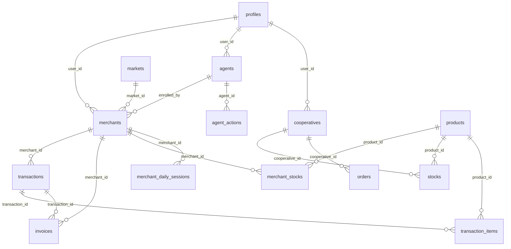

# 🗄️ Schéma Base de Données PNAVIM

Ce document décrit la structure de la base de données PostgreSQL utilisée par PNAVIM.

---

## 📊 Diagramme Entité-Relation



---

## 📋 Tables Principales

### `profiles`
Informations utilisateur liées à Supabase Auth.

| Colonne | Type | Description |
|---------|------|-------------|
| `id` | UUID | Clé primaire |
| `user_id` | UUID | Référence auth.users |
| `full_name` | TEXT | Nom complet |
| `phone` | TEXT | Numéro de téléphone |
| `avatar_url` | TEXT | URL de l'avatar |

---

### `merchants`
Marchands de vivriers.

| Colonne | Type | Description |
|---------|------|-------------|
| `id` | UUID | Clé primaire |
| `user_id` | UUID | Lien vers auth.users |
| `full_name` | TEXT | Nom du marchand |
| `phone` | TEXT | Téléphone (unique) |
| `cmu_number` | TEXT | Numéro CMU |
| `activity_type` | TEXT | Type d'activité |
| `market_id` | UUID | Marché d'appartenance |
| `status` | ENUM | `pending`, `validated`, `suspended` |
| `enrolled_by` | UUID | Agent qui a enrôlé |
| `enrolled_at` | TIMESTAMP | Date d'enrôlement |

---

### `agents`
Agents enrôleurs.

| Colonne | Type | Description |
|---------|------|-------------|
| `id` | UUID | Clé primaire |
| `user_id` | UUID | Lien vers auth.users |
| `employee_id` | TEXT | Matricule agent |
| `organization` | TEXT | Organisation |
| `zone` | TEXT | Zone d'intervention |
| `is_active` | BOOLEAN | Statut actif |
| `total_enrollments` | INT | Nombre d'enrôlements |

---

### `transactions`
Transactions de vente.

| Colonne | Type | Description |
|---------|------|-------------|
| `id` | UUID | Clé primaire |
| `merchant_id` | UUID | Marchand |
| `amount` | NUMERIC | Montant total |
| `transaction_type` | ENUM | `sale`, `refund` |
| `cmu_deduction` | NUMERIC | Prélèvement CMU |
| `rsti_deduction` | NUMERIC | Prélèvement RSTI |
| `reference` | TEXT | Référence unique |
| `created_at` | TIMESTAMP | Date création |

---

### `merchant_stocks`
Stock par marchand.

| Colonne | Type | Description |
|---------|------|-------------|
| `id` | UUID | Clé primaire |
| `merchant_id` | UUID | Marchand |
| `product_id` | UUID | Produit |
| `quantity` | NUMERIC | Quantité en stock |
| `unit_price` | NUMERIC | Prix unitaire |
| `min_threshold` | NUMERIC | Seuil d'alerte |

---

### `products`
Catalogue des produits.

| Colonne | Type | Description |
|---------|------|-------------|
| `id` | UUID | Clé primaire |
| `name` | TEXT | Nom du produit |
| `unit` | TEXT | Unité (kg, pièce, tas...) |
| `category_id` | UUID | Catégorie |
| `is_igp` | BOOLEAN | Produit IGP |

---

### `markets`
Marchés de Côte d'Ivoire.

| Colonne | Type | Description |
|---------|------|-------------|
| `id` | UUID | Clé primaire |
| `name` | TEXT | Nom du marché |
| `commune` | TEXT | Commune |
| `region` | TEXT | Région |
| `latitude` | NUMERIC | Coordonnée GPS |
| `longitude` | NUMERIC | Coordonnée GPS |

---

## 🔐 Énumérations

### `merchant_status`
```sql
CREATE TYPE merchant_status AS ENUM (
  'pending',
  'validated', 
  'suspended',
  'blocked'
);
```

### `transaction_type`
```sql
CREATE TYPE transaction_type AS ENUM (
  'sale',
  'refund'
);
```

### `order_status`
```sql
CREATE TYPE order_status AS ENUM (
  'pending',
  'confirmed',
  'shipped',
  'delivered',
  'cancelled'
);
```

---

## 🔄 Triggers

### Mise à jour automatique `updated_at`
```sql
CREATE TRIGGER update_merchants_updated_at
  BEFORE UPDATE ON merchants
  FOR EACH ROW
  EXECUTE FUNCTION update_updated_at_column();
```

### Incrémentation compteur factures
```sql
CREATE TRIGGER increment_invoice_counter
  AFTER INSERT ON invoices
  FOR EACH ROW
  EXECUTE FUNCTION increment_merchant_invoice_counter();
```

---

## 📈 Index

| Table | Index | Colonnes |
|-------|-------|----------|
| `merchants` | `idx_merchants_phone` | `phone` |
| `merchants` | `idx_merchants_user_id` | `user_id` |
| `transactions` | `idx_transactions_merchant` | `merchant_id, created_at` |
| `merchant_stocks` | `idx_stocks_merchant_product` | `merchant_id, product_id` |

---

## 🔒 Politiques RLS

Voir [SECURITY.md](./SECURITY.md) pour le détail des politiques Row Level Security.
